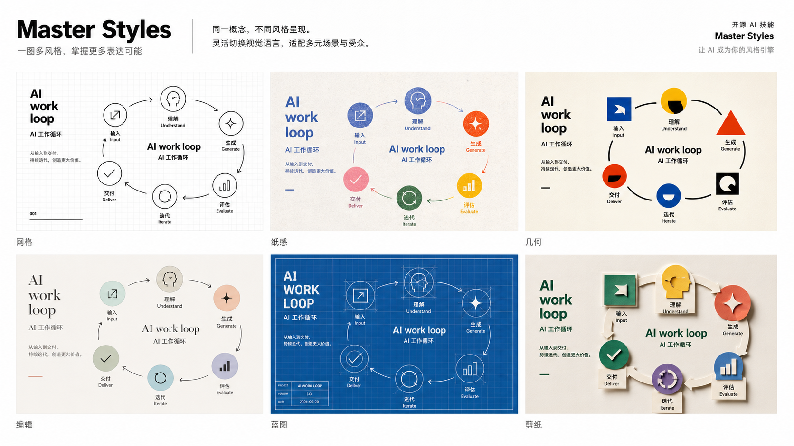

# Master Styles

> A style-routing skill for translating vague aesthetic direction into usable visual tokens and prompt language.

Master Styles is the shared style engine: it maps mood, domain, medium, era, material, color, composition, and abstraction into concrete visual directions that other skills can reuse.

## Examples

<p><br><sub>Master Styles style atlas</sub></p>

## What It Does

- Route visual requests into style families without copying living artists or protected IP.
- Blend style tokens such as Swiss grid, risograph, Bauhaus geometry, blueprint, paper cutout, or editorial diagram.
- Turn fuzzy taste words into concrete color, material, layout, and typography decisions.
- Provide reusable style specs for covers, figures, cards, stickers, and diagrams.

## Install

Clone this repository into your local Codex skills folder:

```bash
mkdir -p ~/.codex/skills
git clone https://github.com/Alexsun1one/master-styles.git ~/.codex/skills/master-styles
```

If your agent expects a nested skill directory instead of a direct clone, copy the folder that contains `SKILL.md` into its skills directory.

## Use

Example request:

```text
Use master-styles to create a style spec for an AI workflow illustration. Compare Swiss grid, risograph paper, Bauhaus geometry, editorial diagram, blueprint, and paper cutout routes.
```

The skill entry point is [`SKILL.md`](SKILL.md). Supporting rules live in [`references/`](references/) when this repo includes them; helper scripts live in [`scripts/`](scripts/) when available.

## Quality Bar

- The image must explain a concrete idea, not merely decorate the page.
- Chinese text should be readable at the actual publishing size.
- The output should keep a stable style system across a set while letting each image fit its topic.
- Generated examples are prompts and visual references, not fixed templates.

## WeChat

More writeups, examples, and AI workflow notes are published on my WeChat official account. This is the real QR/search card used for the account, included as a normal bitmap asset rather than a stylized fake code.

<p align="center">
  
</p>

## License

MIT. See [`LICENSE`](LICENSE).

## Notice

This is an original open-source skill package by Sun Wuyuan / Alexsun1one. It is not affiliated with OpenAI, GitHub, WeChat, or any referenced platform. Avoid using it to imitate protected characters, living artists, or third-party brand assets without permission.
