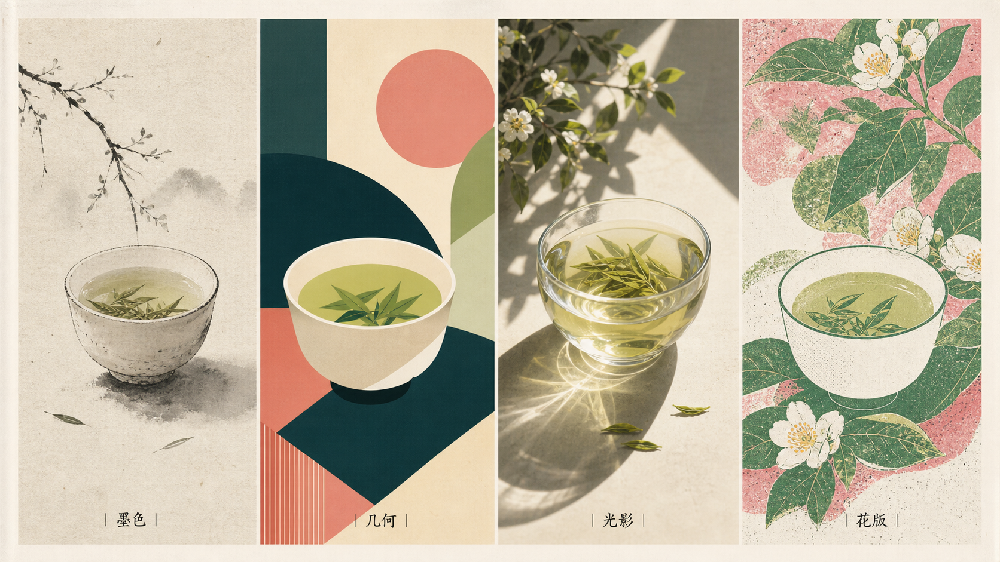

# Master Styles / 视觉风格引擎

> 把“高级一点、纸感一点、像信息图但别 PPT”这种模糊审美，翻译成可复用的视觉 token 和提示词。

Master Styles 是这批视觉 skill 的共享风格路由器。它不负责某一种具体产物，而是帮其它 skill 选择材料、构图、线条、颜色、字体感、抽象程度和风格谱系。适合在做封面、配图、金句卡、表情包、排名卡前先定视觉方向。

## 示例图

<p><br><sub>同一主题，四种视觉语言：风格差异来自材质、构图、线条和色彩，不是套滤镜。</sub></p>
<p><br><sub>视觉风格谱系示例</sub></p>

## 它能做什么

- 把模糊审美词拆成颜色、材质、构图、线条、字体、空间和抽象度。
- 路由到 Swiss grid、risograph、Bauhaus geometry、blueprint、paper cutout、editorial diagram 等风格族。
- 避免直接模仿在世艺术家或第三方 IP，而是抽象出合法可复用的风格 token。
- 为其它 skill 输出统一 style spec。

## 安装

把这个仓库克隆到本机 Codex skills 目录：

```bash
mkdir -p ~/.codex/skills
git clone https://github.com/Alexsun1one/master-styles.git ~/.codex/skills/master-styles
```

如果你的 Agent 使用其它 skills 目录，也可以把包含 `SKILL.md` 的这个仓库复制过去。

## 怎么用

示例请求：

```text
用 master-styles 给一张 AI 工作流配图制定视觉方向。比较网格、纸感、几何、编辑图解、蓝图、剪纸六种路线，并推荐最适合公众号正文的一种。
```

Skill 入口是 [`SKILL.md`](SKILL.md)。细则在 [`references/`](references/)；如果这个仓库带脚本，脚本在 [`scripts/`](scripts/)。

## 质量要求

- 先服务内容，再服务风格；图必须解释一个具体想法。
- 中文默认要可读，标题、caption、标签不能只当装饰纹理。
- 同一组图要风格统一，但每张图要贴合自己的段落/用途。
- 示例图是工作流参考，不是唯一模板。

## 公众号

更完整的拆解、提示词、案例复盘、AI 写作和产品实践，我会继续写在公众号里。下面是我的真实公众号二维码/搜一搜卡片，不是仿造的装饰二维码。

<p align="center">
  
</p>

## 开源协议

MIT。见 [`LICENSE`](LICENSE)。

## 声明

这是 Sun Wuyuan / Alexsun1one 的原创开源 Skill 包。它不隶属于 OpenAI、GitHub、微信或任何被提及的平台。请不要用它去复制受保护 IP、仿冒在世艺术家，或暗示不存在的品牌背书。
